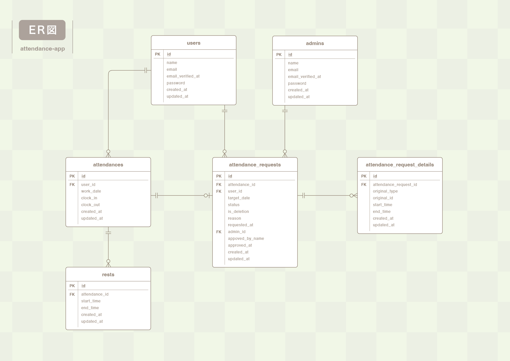

# attendance-app (coachtech 勤怠管理アプリ)

## アプリについて
出勤・退勤、休憩時間の打刻を行うと、その記録内容に基づき実労働時間を計算。ユーザーの月次勤怠を自動作成する勤怠アプリです。本アプリに登録したユーザーは勤怠打刻のほか、WEB上で自身の登録した勤怠の修正申請を行うことができます。申請された勤怠は管理者が精査、承認することで勤怠情報を変更することが可能です。 

また管理者は管理者IDを持つことで、一般ユーザーでは利用できない管理者専用画面を操作できます。日毎のスタッフの勤務状況をリアルタイムで確認したり、スタッフ別の月次勤怠の出力も行えます。前述の修正申請の承認動作だけでなく、管理者による直接修正も行えるため、迅速で正確な勤怠管理を実現することができます。

### 実装されている機能について
本件は模擬案件という課題の一つですが、機能要件を満たした上で、自己研鑽と訓練のためにプラスアルファで機能を追加実装しております。追加した機能については以下をご一読の上、本来の機能要件のみで採点していただければ幸いでございます。


## 環境構築
1. Githubからプロジェクトをクローンしてください。
``` bash
git clone git@github.com:hayakawajun/attendance-app.git
```
2. Docker Desktop アプリを立ち上げます。

3. プロジェクト直下に移動し、次のコマンドを実行してください。  
( 環境構築からダミーデータのシーディングまでが完了します )
``` bash
make init
```
### 作成されるダミーデータについて
- 一般ユーザーアカウント  
name : 偽山田　贋作  
email : dummy@test.com  
pass : dummypass  

- 管理者アカウント  
name : 管理屋崎　省吾  
email : admin@test.com  
pass : adminpass  

- 勤怠データ (前月分)  
シーディングを行った日を基準に、前月分の勤怠情報が作成されます。  
土日を除いた月〜金曜日に出勤しており、  
　奇数週は 08:00出勤ー17:00退勤、60分休憩１回、実働８時間  
　偶数週は、17:00出勤ー翌02:00退勤、30分休憩を２回、実働８時間  
で作成されます。  

- 勤怠データ (前々月分)  
こちらもシーディングを行った日を基準に、前々月分の勤怠情報が作成されます。  
１日のみ勤怠が作成されますが、休憩戻と退勤が未入力の勤怠です。  
これは打刻漏れを自動補完する仕組みを試すためのダミーデータです。  
PHPコンテナ内で次のコマンドを手動入力することで、未入力勤怠の自動補完を行います。  
( コマンドにより04:58休憩戻、04:59退勤のデータが補完されます )
``` bash
php artisan auto:clock-out
```
> *このコマンドを定刻に行う設定をKernel.phpに記述していますが、ローカル環境では作動しないため、上記の手動コマンドで自動補完を擬似体験できます。*

## テーブル仕様
### users テーブル
スタッフ（一般ユーザー）を登録し、ログイン情報としても使用します。
| カラム名 | 型 | primary key | unique key | not null | foreign key |
| --- | --- | --- | --- | --- | --- |
| id | unsigned bigint | ◯ |  | ◯ |  |
| name | varchar(255) |  |  | ◯ |  |
| email | varchar(255) |  | ◯ | ◯ |  |
| email_verified_at | timestamp |  |  |  |  |
| password | varchar(255) |  |  | ◯ |  |
| created_at | timestamp |  |  |  |  |
| updated_at | timestamp |  |  |  |  |

### admins テーブル
管理者を登録し、ログイン情報としても使用します。
| カラム名 | 型 | primary key | unique key | not null | foreign key |
| --- | --- | --- | --- | --- | --- |
| id | unsigned bigint | ◯ |  | ◯ |  |
| name | varchar(255) |  |  | ◯ |  |
| email | varchar(255) |  | ◯ | ◯ |  |
| email_verified_at | timestamp |  |  |  |  |
| password | varchar(255) |  |  | ◯ |  |
| created_at | timestamp |  |  |  |  |
| updated_at | timestamp |  |  |  |  |

### attendances テーブル
出退勤情報を登録します。スタッフの勤務ごとにレコードが作成されますが、同一勤務日には１レコードしか作成できません。
| カラム名 | 型 | primary key | unique key | not null | foreign key |
| --- | --- | --- | --- | --- | --- |
| id | unsigned bigint | ◯ |  | ◯ |  |
| user_id | unsigned bigint |  |  | ◯ | ◯ |
| work_date | date |  |  | ◯ |  |
| clock_in | datetime |  |  | ◯ |  |
| clock_out | datetime |  |  |  |  |
| created_at | timestamp |  |  |  |  |
| updated_at | timestamp |  |  |  |  |

### rests テーブル
勤務( attendances テーブル )と紐ついた休憩情報を登録します。休憩は出勤中、複数回取ることができ、休憩に入るたびにレコードが作成されます。
| カラム名 | 型 | primary key | unique key | not null | foreign key |
| --- | --- | --- | --- | --- | --- |
| id | unsigned bigint | ◯ |  | ◯ |  |
| attendance_id | unsigned bigint |  |  | ◯ | ◯ |
| start_time | datetime |  |  | ◯ |  |
| end_time | datetime |  |  |  |  |
| created_at | timestamp |  |  |  |  |
| updated_at | timestamp |  |  |  |  |

### attendance_requests テーブル
スタッフによる勤怠の修正申請、または管理者による直接修正を行うとレコードが作成されます。  
is_deletion カラムは削除フラグです。値が「true（1）」の場合、削除申請として扱われ、承認されると該当の勤怠情報が削除されます。  
管理者名を保存するカラムもあります。これは承認した管理者が何らかの理由でIDを削除した場合の手がかりとして機能する想定です。  
デフォルト値：status は「pending」、　is_deletion は「false（0）」
| カラム名 | 型 | primary key | unique key | not null | foreign key |
| --- | --- | --- | --- | --- | --- |
| id | unsigned bigint | ◯ |  | ◯ |  |
| attendance_id | unsigned bigint |  |  |  | ◯ |
| user_id | unsigned bigint |  |  | ◯ | ◯ |
| target_date | date |  |  | ◯ |  |
| status | varchar(255) |  |  | ◯ |  |
| is_deletion | boolean |  |  | ◯ |  |
| reason | varchar(255) |  |  | ◯ |  |
| requested_at | datetime |  |  |  |  |
| admin_id | unsigned bigint |  |  |  | ◯ |
| approved_by_name | varchar(255) |  |  |  |  |
| approved_at | datetime |  |  |  |  |
| created_at | timestamp |  |  |  |  |
| updated_at | timestamp |  |  |  |  |

### attendance_request_details テーブル
申請( attendance_requests テーブル)と紐ついた修正明細が登録されます。出退勤のみ、単数の休憩のみの修正の場合は１レコード、複数の休憩の修正の場合や、出退勤と休憩両方を修正する場合は、修正箇所に応じた数のレコードが作成されます。  
※ original カラムはマイグレーションすると original_type と original_id カラムに分かれます。前者には対応するモデルが入り、後者にはそのモデルが扱うテーブル内でのIDが入ります。この値を元に各テーブルのレコードを上書きしたり、新規作成したりします。
| カラム名 | 型 | primary key | unique key | not null | foreign key |
| --- | --- | --- | --- | --- | --- |
| id | unsigned bigint | ◯ |  | ◯ |  |
| attendance_request_id | unsigned bigint |  |  | ◯ | ◯ |
| original | ※ |  |  |  |  |
| start_time | datetime |  |  |  |  |
| end_time | datetime |  |  |  |  |
| created_at | timestamp |  |  |  |  |
| updated_at | timestamp |  |  |  |  |

## PHPUnit を利用したテストについて
### テスト用データベースの作成

``` bash
// MySQLコンテナに入ります。
docker-compose exec mysql bash

// ユーザーを指定します。
mysql -u root -p

// パスワードは「root」と入力してMySQLにログインしてください。

// テスト用データベースを作成します。
CREATE DATABASE demo_test;
```
### テスト用の環境設定ファイルを作成

``` bash
// PHPコンテナに入ります。
docker-compose exec php bash

// 「.env.example」ファイルをコピーして「.env.testing」ファイルを作成してください。
cp .env.example .env.testing
```
### 環境変数の修正

作成した「.env.testing」ファイルの環境変数を以下に修正してください。
- アプリに関する設定
``` text
APP_NAME=Laravel
APP_ENV=test
APP_KEY=
APP_DEBUG=true
APP_URL=http://localhost
```
- データベースに関する設定
``` text
DB_CONNECTION=mysql_test
DB_HOST=mysql
DB_PORT=3306
DB_DATABASE=demo_test
DB_USERNAME=root
DB_PASSWORD=root
```
- mailhogによるメール認証テストに関する設定
``` text
MAIL_MAILER=smtp
MAIL_HOST=mailhog
MAIL_PORT=1025
MAIL_USERNAME=null
MAIL_PASSWORD=null
MAIL_ENCRYPTION=null
MAIL_FROM_ADDRESS=test@example.com
MAIL_FROM_NAME="${APP_NAME}"
```
### テスト用アプリケーションキーの生成とテーブル作成
``` bash
// PHPコンテナに入ります。
docker-compose exec php bash

// テスト用のアプリケーションキーを生成します。
php artisan key:generate —-env=testing

// 最新の「.env.testing」ファイルの設定を有効にするためキャッシュをクリアします。
php artisan config:clear

// テスト用のテーブルを作成します。
php artisan migrate —-env=testing
```
### テストファイルについて
tests/Feature ディレクトリ以下にテストファイルを配置しています。  
スプレッドシートのテストケース一覧に対応させ、１ファイルに１テスト項目をまとめており、全部で 16 のテストファイルが存在します。ファイルによっては記述量がコーディング規約の200行を超えていますが、テスト細目の整理目的ですのでご容赦ください。  
またそれぞれのファイル内に、テスト内容をタイトルとしてコメントアウトしていますのでご参照ください。

## 使用技術(実行環境)について

- PHP 8.2.30
- Laravel 8.83.29
- MySQL 8.0.26
- nginx 1.21.1

## 使用技術(フロントエンド)

- HTML/CSS
- JavaScript (一部ビューファイルで使用しています。)

## ER図



## 開発環境(URL)
- 一般ユーザー登録：http://localhost/register
- 一般ユーザーログインページ：http://localhost/login
- 管理者ユーザーログインページ：http://localhost/admin/login
- phpMyAdmin：http://localhost:8080/
- mailhog：http://localhost:8025/